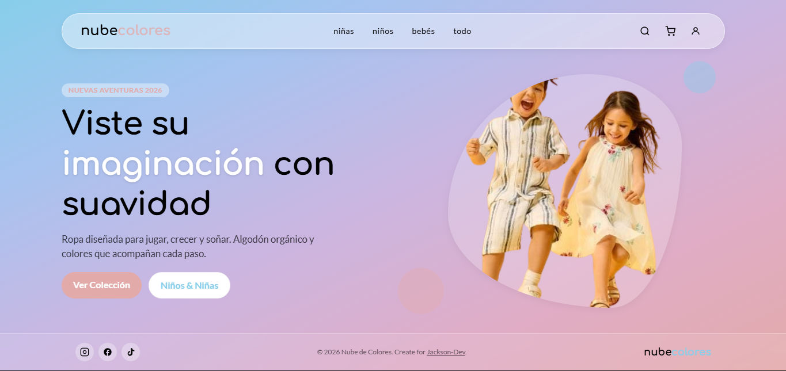

# Nube de Colores | E-commerce Infantil

Plataforma de comercio electrónico especializada en ropa para niños y niñas, diseñada con una estética lúdica, suave y moderna utilizando **Astro + Tailwind CSS v4 + shadcn**.

## 🎨 Patrón de Diseño: Lúdico-Orgánico (Signature Design)

El proyecto se basa en el patrón de **Componentes Atómicos** integrados en un sistema de **Capas y Superficies (Layered Surfaces)**. Decisiones técnicas clave:

- **Firma Visual (Organic Signatures):** `blobs` (formas orgánicas) y bordes redondeados irregulares (`--radius-blob`) rompen la rigidez tradicional y evocan suavidad y juego infantil.
- **Transparencia y Profundidad:** `Glassmorphism` en navegación y pie de página integrado con el fondo degradado; el contenido "flota" sin barreras pesadas.
- **Arquitectura de Tokens:** Paleta, tipografía, radios, sombras y animaciones centralizadas en la capa `@theme` de Tailwind v4.
  - **Paleta:** Rosa Pastel `#E3AAAA`, Azul Cielo `#87CEEB`, Blanco `#FFFFFF`, Negro `#000000`.
  - **Tipografía:** `Comfortaa` (títulos), `Lato` (contenido).
- **Estructura Asimétrica:** Hero no lineal que guía la vista de forma dinámica.

## 🎯 Migración a Tailwind CS
S v4 (CSS-first)

Se reemplazó la hoja global basada en variables CSS por el enfoque **CSS-first** de Tailwind v4, eliminando `tailwind.config.*` y delegando la configuración al propio stylesheet.

### Integración

- Plugin **`@tailwindcss/vite`** registrado en `astro.config.mjs` para procesar clases en tiempo de build sin paso extra de PostCSS.
- Import único en `src/styles/global.css`:
  ```css
  @import "tailwindcss";
  ```
- Inyección global desde `Layout.astro` (`import "../styles/global.css"`).

### Tokens de diseño (`@theme`)

Los tokens se declaran dentro de `@theme { ... }` y Tailwind los expone automáticamente como utilidades (`bg-brand-pink`, `text-brand-blue`, `rounded-[var(--radius-pill)]`, etc.):

- **Colores de marca** (`--color-brand-pink`, `--color-brand-blue`, `--color-ink`, `--color-paper`) y stops del degradado.
- **Fuentes** (`--font-title`, `--font-body`).
- **Radios** incluyendo firma orgánica (`--radius-blob`).
- **Sombras** suaves y flotantes.
- **Animaciones** personalizadas (`--animate-morph`, `--animate-float-slow`) con sus `@keyframes` embebidos dentro del bloque `@theme`.

### Layout sin scroll (viewport-bound)

Requisito: el footer debe permanecer anclado al fondo y la vista nunca debe desbordarse. Solución en columna flex fija al viewport:

- `<html>` y `<body>`: `h-dvh overflow-hidden flex flex-col` (usa `dvh` para respetar barras dinámicas en mobile).
- **Navbar / Footer**: `shrink-0` → nunca colapsan.
- **`<main>`**: `flex-1 min-h-0 overflow-hidden` → absorbe el espacio restante sin propagar el desbordamiento intrínseco del contenido.
- **Hero**: tipografía fluida con `clamp()`, grid responsivo y visual (blob + burbujas) oculto en mobile (`hidden md:flex`) para garantizar encaje en alturas reducidas.

### Responsive mobile-first

- **Navbar mobile**: enlaces y acciones colapsados en un menú **hamburguesa** implementado con `<details>` nativo (accesible, sin dependencias). Panel absoluto con animación (`opacity + translate + scale`, `duration-200`).
- **Footer mobile**: logo oculto, redes sociales colapsadas en un `<details>` que **abre hacia arriba** (`bottom-[calc(100%+0.5rem)]`) para minimizar la altura del pie. Icono *share* como trigger; panel contiene Instagram, Facebook y TikTok.
- **Buscador inteligente**: el botón de lupa dentro del menú hamburguesa **no cierra el menú**; despliega un `<input>` inline animado (expansión de ancho + fade) gracias a atributos `data-no-close` / `data-search-toggle` y un script mínimo.
- **Z-index stack**: footer `z-40`, panel dropdown `z-50` → siempre visibles sobre blobs y burbujas del Hero.

### Comportamiento de los `<details>`

Script global en `Layout.astro`:

1. **Click fuera**: cualquier `<details>` abierto se cierra si el click cae fuera de su subárbol.
2. **Click interno en `<a>/<button>`**: cierra el panel salvo que el nodo tenga `data-no-close` (lupa) o sea el propio `<summary>`.
3. Animaciones CSS habilitadas mediante override `details > *:not(summary) { display: block }` para que el navegador no oculte el contenido en estado cerrado (permitiendo transicionar `opacity`/`transform`).

## 💳 Integración de Pagos (Stripe)

El flujo de pago utiliza **Stripe PaymentElement** con modo de pruebas activo.

### Arquitectura

- **`src/pages/api/create-payment-intent.ts`**: endpoint SSR que crea el `PaymentIntent` en Stripe con el monto real (en PEN) y devuelve el `clientSecret`.
- **`src/components/PaymentDialog.tsx`**: dialog con `CheckoutForm` que valida, llama al endpoint y confirma el pago vía `stripe.confirmPayment()` sin redirección externa.
- **`src/components/CartSheet.tsx`**: monta el provider `<Elements>` de Stripe al abrir el carrito (pre-inicialización), eliminando la latencia al abrir el dialog de pago.

### Decisiones técnicas

- `redirect: 'if_required'` en `confirmPayment` → el usuario nunca abandona la página.
- `wallets: { link: 'never', applePay: 'never', googlePay: 'never' }` → formulario minimalista sin métodos alternativos.
- `@astrojs/vercel` como adapter SSR para el endpoint en producción (Vercel Serverless Functions).
- Variables de entorno: `STRIPE_SECRET_KEY` (server) y `PUBLIC_STRIPE_PUBLISHABLE_KEY` (client). Nunca commitear `.env`.

### Tarjetas de prueba

| Número | Resultado |
|---|---|
| `4242 4242 4242 4242` | Pago exitoso |
| `4000 0025 0000 3155` | Requiere 3D Secure |
| `4000 0000 0000 9995` | Fondos insuficientes |

## 🚀 Estructura del Proyecto

```
src/
├── components/    # Navbar, Hero, Footer, CartSheet, PaymentDialog
├── layouts/       # Layout base (script global de <details>)
├── pages/
│   ├── api/
│   │   └── create-payment-intent.ts  # Endpoint SSR de Stripe
│   └── index.astro
└── styles/
    └── global.css # @import "tailwindcss" + @theme tokens
```

## 🛠️ Comandos

| Comando        | Acción                                      |
| :------------- | :------------------------------------------ |
| `pnpm dev`     | Inicia el servidor de desarrollo local.     |
| `pnpm build`   | Compila el sitio para producción.           |
| `pnpm preview` | Previsualiza la compilación localmente.     |

## 📝 Log de Errores

- **2024-04-17:** Limpieza inicial del proyecto (eliminación de `Welcome.astro` y assets por defecto). Se corrigió la configuración de fuentes de Google en el `Layout` para evitar problemas de carga asíncrona mediante enlaces `preconnect` y `link` tradicionales.
- **2024-04-17:** Resolución de conflicto en el `Navbar` fijo sobre el `Hero` mediante `padding-top` en el contenedor y `backdrop-filter` para asegurar legibilidad.
- **2026-04-18:** Migración a Tailwind CSS v4. Se sustituyó la hoja global CSS nativa por configuración **CSS-first** (`@theme`), eliminando `tailwind.config.*`. Se refactorizó el layout a modelo **viewport-bound** (`h-dvh overflow-hidden flex-col`) para cumplir el requisito de footer anclado y vista sin scroll.
- **2026-04-18:** `<details>` nativo elegido para hamburguesa (Navbar) y dropdown de redes (Footer) por accesibilidad y ausencia de JS pesado. Problema: el navegador oculta el contenido cerrado mediante `display:none`, bloqueando transiciones CSS. Solución: override `details > *:not(summary) { display: block }` + estado cerrado con `opacity-0 + translate + pointer-events-none` controlado por `group-open:`.
- **2026-04-18:** Botón de búsqueda requería abrir input sin cerrar el menú. Script global cerraba todo `<a>/<button>` interno. Solución: atributo marcador `data-no-close` respetado por el handler, acompañado de un script local que alterna visibilidad del input con animación de ancho + opacidad.
- **2026-04-18:** Panel dropdown del Footer quedaba detrás de blobs/burbujas del Hero. Se añadió `z-40` al footer y `z-50` al panel para establecer un stacking context superior al contenido del Hero (`z-10`).
- **2026-04-20:** Integración de Stripe PaymentElement. Error inicial: `.vercel/output/` commiteado con la secret key embebida en el bundle SSR. Resolución: agregar `.vercel/` al `.gitignore`, rotar la clave en Stripe Dashboard y usar bypass de GitHub Secret Scanning (clave de prueba ya inválida).
- **2026-04-20:** `output: 'hybrid'` eliminado en Astro 6 — reemplazado por comportamiento por defecto de `output: 'static'` con `export const prerender = false` por ruta. Adapter cambiado de `@astrojs/node` a `@astrojs/vercel` para compatibilidad con Serverless Functions.
- **2026-04-20:** Link de Stripe aparecía en el formulario por defecto al usar `automatic_payment_methods`. Resuelto con `wallets: { link: 'never' }` en las opciones de `PaymentElement`. Además, el dialog desbordaba verticalmente al expandirse el componente de Link — corregido con `max-h-[90vh] overflow-y-auto` en `DialogContent`.
- **2026-04-20:** Latencia al abrir el dialog de pago causada por inicialización tardía de Stripe Elements. Resuelto moviendo el provider `<Elements>` a `CartSheet` para pre-inicializar la sesión al abrir el carrito.
